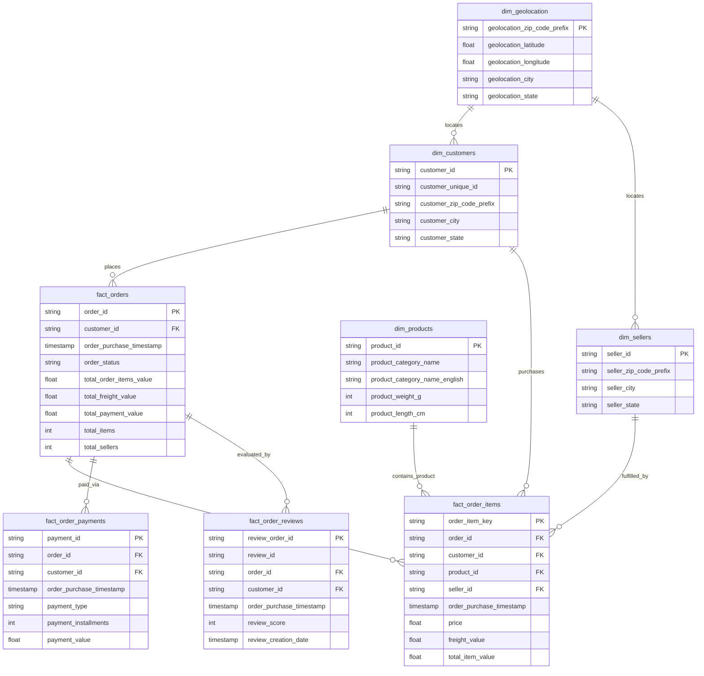

# Olist GCP DataOps Platform
### Enterprise-Grade, Serverless & Zero-Cost ($0.00 spend) Data Lakehouse on Google Cloud Platform

[](https://github.com/murad-1999/olist-gcp-dataops-platform/actions/workflows/pr-checks.yml)
[](https://github.com/murad-1999/olist-gcp-dataops-platform/actions/workflows/deploy.yml)
[](https://cloud.google.com/free/docs/free-cloud-features#always-free-products)
[](https://www.terraform.io/)
[](https://www.getdbt.com/)
[](https://www.docker.com/)
[-green?logo=google-authenticator&logoColor=white)](https://cloud.google.com/iam/docs/workload-identity-federation)

---

## Executive Summary

The **Olist GCP DataOps Platform** is an automated, production-ready serverless data lakehouse built on Google Cloud Platform to analyze the [Brazilian E-Commerce Public Dataset by Olist](https://www.kaggle.com/datasets/olistbr/brazilian-ecommerce) (~100k customer orders across Brazil from 2016 to 2018).

This platform demonstrates modern data engineering and DataOps principles—including **Infrastructure as Code (IaC)**, **containerized scale-to-zero serverless ingestion**, **Medallion Architecture modeling (Bronze/Silver/Gold)**, **automated CI/CD testing with keyless OIDC authentication**, and **Looker Studio BI visualization**—all while operating under a strict **$0.00 spend guarantee (100% GCP Always Free Tier)**.

---

## Architecture Overview

```
                          INGESTION & STORAGE                                        TRANSFORMATION & ANALYTICS
                                (Bronze)                                                   (Silver & Gold)

  ┌─────────────────┐
  │   Kaggle API    │
  └────────┬────────┘
           │ (Hourly / Scheduled)
           ▼
  ┌─────────────────────────────────┐
  │ Google Cloud Scheduler          │
  └────────┬────────────────────────┘
           │ (OIDC HTTP Trigger)
           ▼
  ┌─────────────────────────────────┐         ┌─────────────────────────┐
  │ Google Cloud Run                │◄────────┤ Google Secret Manager   │
  │ (Docker / Python 3.11 Ingestion)│         │ (Kaggle API Token)      │
  └────────┬────────────────────────┘         └─────────────────────────┘
           │
           │ (Idempotent Raw CSV Ingestion)
           ▼
  ┌─────────────────────────────────┐
  │ Google Cloud Storage (GCS)      │  <── Bronze Landing Layer (5 GB Free Tier Guardrails)
  │ (Lifecycle-pruned Bucket)       │
  └────────┬────────────────────────┘
           │
           │ (External Table Bindings)
           ▼
  ┌─────────────────────────────────┐
  │ BigQuery: olist_bronze          │  <── 9 Raw External Tables
  └────────┬────────────────────────┘
           │
           │ (dbt staging: Type Casting, Portuguese-English Translations, Deduplication)
           ▼
  ┌─────────────────────────────────┐
  │ BigQuery: olist_silver          │  <── 9 Staging Views
  └────────┬────────────────────────┘
           │
           │ (dbt marts: Kimball Star Schema, Day Partitioning & High-Cardinality Clustering)
           ▼
  ┌─────────────────────────────────┐
  │ BigQuery: olist_gold            │  <── 4 Facts + 4 Dimensions (Production Ready)
  └────────┬────────────────────────┘
           │
           │ (Direct Native BigQuery Connector, Partition Pruning & Zero Egress)
           ▼
  ┌─────────────────────────────────┐
  │ Google Looker Studio            │  <── 3-Page Executive & Operational BI Dashboard
  │ (Executive BI Dashboards)       │
  └─────────────────────────────────┘
```

---

## Strict Zero-Cost ($0.00 / Always Free Tier) Guardrails

The platform is strictly engineered to guarantee **$0.00 billing** by adhering to Google Cloud's Always Free tier quotas:

| GCP Service | Always Free Tier Allowance | Platform Implementation & Cost Guardrail |
| :--- | :--- | :--- |
| **Cloud Run** | 2M requests/mo, 360k vCPU-sec, 180k GiB-sec | `min_instances = 0` (scale-to-zero), `cpu_idle = true`, `max_instances = 2`, minimal sizing (1 vCPU, 512MiB). |
| **Cloud Storage** | 5 GB standard storage/mo | Ingestion payload is ~120 MB. Bucket lifecycle rules auto-purge noncurrent versions after 7 days. |
| **BigQuery** | 10 GB active storage, 1 TB queries/mo | Star schema footprint is ~50 MB. All facts partitioned by day (`order_purchase_timestamp`) and clustered to minimize query scans. |
| **Artifact Registry**| 0.5 GB storage/mo | Automated cleanup policy retains only the 3 most recent Docker images; base image uses lightweight `python:3.11-slim`. |
| **Cloud Scheduler** | 3 active jobs/mo | Exactly 1 scheduled job configured to trigger ingestion. |
| **Secret Manager** | 6 active secret versions | Single secret version for Kaggle API credentials. |
| **Network Egress** | Zero egress within region | All resources (Cloud Run, GCS, BigQuery, Artifact Registry) colocated in `us-central1`. |
| **Cost Alert Guardrail** | **$0.01 Threshold** | Terraform provisions a Cloud Billing Budget alert triggering at $0.01 to immediately notify on any unintended spend. |

### Prohibited Architecture Patterns (Zero-Cost Enforcement)
* **No Continuous Compute:** Zero Compute Engine VMs, Dataproc, or GKE nodes.
* **No Cloud SQL:** Managed databases lack an Always Free tier; BigQuery serverless storage is used instead.
* **No Orchestration Overhead:** Zero Cloud Composer (Airflow) instances; Cloud Scheduler + Cloud Run provides lightweight, zero-idle orchestration.
* **No Networking Charges:** Zero Cloud NAT gateways, VPN tunnels, or reserved external IP addresses.

---

## Medallion Lakehouse Architecture

The data pipeline progresses through three distinct layers:

### 1. Bronze Layer (`olist_bronze`)
* Raw data extracted directly from Kaggle API as CSV files into GCS.
* Defined as BigQuery External Tables via Terraform—zero ingestion compute or storage duplication cost:
  * `raw_orders`, `raw_order_items`, `raw_order_payments`, `raw_order_reviews`
  * `raw_customers`, `raw_sellers`, `raw_products`, `raw_geolocation`, `raw_product_category_name_translation`

### 2. Silver Layer (`olist_silver`)
* Cleaned, typed, and deduplicated staging models built as BigQuery SQL views via dbt Core:
  * Casts string timestamps to native BigQuery `TIMESTAMP`.
  * Deduplicates records using `QUALIFY ROW_NUMBER() OVER (...) = 1`.
  * Normalizes Portuguese column names and attributes into standardized English conventions.

### 3. Gold Layer (`olist_gold`)
* Production Kimball-style dimensional star schema optimized for BI consumption:
  * Fact and dimension tables materialized natively in BigQuery.
  * Fact tables daily partitioned by `order_purchase_timestamp` and clustered by high-cardinality foreign keys.
  * Pre-aggregated order-level totals eliminate Cartesian fan-outs during BI joins.



---

## Repository Structure

```
olist-gcp-dataops-platform/
├── .github/
│   └── workflows/
│       ├── pr-checks.yml               # PR validation: flake8, terraform plan (WIF), dbt compile
│       └── deploy.yml                  # CD pipeline: Docker build/push, terraform apply, dbt run/test
├── .antigravity                        # Architectural rules & strict zero-billing constraints
├── docs/
│   └── bi_looker_studio.md             # Looker Studio setup guide, KPI formulas & dashboard blueprints
├── ingestion/
│   ├── src/
│   │   └── extract.py                  # Idempotent Kaggle extraction & Cloud Run HTTP handler
│   ├── Dockerfile                      # Minimal python:3.11-slim container definition
│   └── requirements.txt                # kaggle, google-cloud-storage, google-cloud-secret-manager
├── terraform/
│   ├── backend.tf                      # Remote GCS state declaration
│   ├── environments/
│   │   └── dev/                        # Dev environment composition
│   │       ├── main.tf                 # Root module orchestration
│   │       ├── variables.tf            # Parameterized variables
│   │       ├── outputs.tf              # Provisioned resource identifiers
│   │       └── terraform.tfvars.example# Template for local dev variables
│   └── modules/                        # Reusable infrastructure modules
│       ├── artifact_registry/          # Container registry with cleanup policies
│       ├── bigquery/                   # Bronze, Silver, Gold datasets + 9 external tables
│       ├── budget/                     # $0.01 Cloud Billing budget alert module
│       ├── cloud_run/                  # Scale-to-zero serverless compute service
│       ├── cloud_scheduler/            # OIDC-authenticated cron trigger
│       ├── iam/                        # Workload Identity Federation & service accounts
│       ├── iam_secrets/                # Kaggle secret manager bindings
│       └── storage/                    # Bronze GCS bucket with lifecycle retention
└── dbt_olist/
    ├── dbt_project.yml                 # dbt project configurations & materialization targets
    ├── profiles.yml                    # BigQuery connection configuration (oauth / ADC)
    ├── macros/
    │   └── generate_schema_name.sql    # Schema naming override macro
    └── models/
        ├── staging/                    # Silver layer staging views & cast definitions
        │   ├── schema.yml              # Primary key & non-null constraints
        │   └── stg_olist_*.sql         # 9 staging views
        └── marts/                      # Gold layer dimensional star schema
            ├── schema.yml              # Uniqueness, non-null & referential integrity tests
            ├── dim_*.sql               # 4 dimension tables
            └── fact_*.sql              # 4 fact tables (partitioned & clustered)
```

---

## Security & Governance

1. **Keyless CI/CD via Workload Identity Federation (WIF):**
   * Long-lived service account JSON keys are strictly prohibited and eliminated.
   * GitHub Actions generates temporary OpenID Connect (OIDC) tokens exchanged with Google Cloud IAM via short-lived federated credentials.
2. **Runtime Secret Injection:**
   * Kaggle API credentials are stored in Google Secret Manager.
   * Cloud Run mounts or fetches credentials securely into memory at runtime via dedicated IAM service account bindings.
3. **Data Quality Enforcements (dbt Tests):**
   * Primary key `unique` and `not_null` assertions enforced on all Silver and Gold models.
   * Foreign key `relationships` tests strictly validate dimensional integrity across all fact tables.

---

## Quickstart & Local Deployment Guide

### Prerequisites
* [Google Cloud SDK (`gcloud`)](https://cloud.google.com/sdk/docs/install)
* [Terraform v1.5+](https://developer.hashicorp.com/terraform/install)
* [Docker Desktop / Engine](https://docs.docker.com/get-docker/)
* [Python 3.9+](https://www.python.org/)
* Kaggle Account and API Token (`kaggle.json`)

---

### Step 1: Initial GCP Setup & Authentication

```bash
# Log in to Google Cloud
gcloud auth login
gcloud auth application-default login

# Set your active GCP project
export GCP_PROJECT_ID="your-project-id"
gcloud config set project ${GCP_PROJECT_ID}

# Enable required Google APIs
gcloud services enable \
  iam.googleapis.com \
  iamcredentials.googleapis.com \
  cloudresourcemanager.googleapis.com \
  storage.googleapis.com \
  bigquery.googleapis.com \
  run.googleapis.com \
  cloudscheduler.googleapis.com \
  secretmanager.googleapis.com \
  artifactregistry.googleapis.com \
  billingbudgets.googleapis.com
```

---

### Step 2: Store Kaggle API Secrets

```bash
# Create the secret for Kaggle API credentials
gcloud secrets create kaggle-api-credentials \
  --replication-policy="automatic" \
  --project="${GCP_PROJECT_ID}"

# Add your Kaggle JSON token as a version
gcloud secrets versions add kaggle-api-credentials \
  --data-file="/path/to/your/kaggle.json" \
  --project="${GCP_PROJECT_ID}"
```

---

### Step 3: Infrastructure Deployment via Terraform

```bash
cd terraform/environments/dev

# Create your terraform.tfvars from example
cp terraform.tfvars.example terraform.tfvars

# Edit terraform.tfvars with your GCP project_id and raw_bucket_name
nano terraform.tfvars

# Initialize Terraform with your remote state bucket (or local backend for bootstrap)
terraform init -backend-config="bucket=${GCP_PROJECT_ID}-tf-state"

# Provision Artifact Registry first
terraform apply -target=module.artifact_registry -auto-approve \
  -var="docker_image=dummy" \
  -var="github_repo=your-username/olist-gcp-dataops-platform"

# Build and push the ingestion container
cd ../../../ingestion
IMAGE_URI="us-central1-docker.pkg.dev/${GCP_PROJECT_ID}/olist-dataops-repo/ingestion:latest"
gcloud auth configure-docker us-central1-docker.pkg.dev
docker build -t ${IMAGE_URI} .
docker push ${IMAGE_URI}

# Deploy complete platform infrastructure
cd ../terraform/environments/dev
terraform apply -auto-approve \
  -var="docker_image=${IMAGE_URI}" \
  -var="github_repo=your-username/olist-gcp-dataops-platform"
```

---

### Step 4: Execute Ingestion Pipeline

You can trigger the serverless ingestion service directly on Cloud Run:

```bash
# Obtain Cloud Run service URL from terraform output
SERVICE_URL=$(terraform output -raw cloud_run_service_uri)

# Trigger extraction HTTP endpoint
curl -X POST "${SERVICE_URL}/extract" \
  -H "Authorization: Bearer $(gcloud auth print-identity-token)"
```

The CSV datasets will land in `gs://${GCP_PROJECT_ID}-raw-bronze/` and instantly populate `olist_bronze` external tables in BigQuery.

---

### Step 5: Run Transformations & Verify Quality (dbt)

```bash
cd ../../../dbt_olist

# Install dbt dependencies
dbt deps

# Run transformations for Silver (views) and Gold (star schema tables)
dbt run --vars "project_id: ${GCP_PROJECT_ID}"

# Execute all automated data quality and referential integrity tests
dbt test --vars "project_id: ${GCP_PROJECT_ID}"
```

---

### Step 6: BI & Dashboarding (Looker Studio)

Connect Google Looker Studio directly to BigQuery dataset `olist_gold`:
* Follow the step-by-step connection instructions, calculated metric formulas, and dashboard blueprints in [`docs/bi_looker_studio.md`](docs/bi_looker_studio.md).

---

## Continuous Integration & Continuous Deployment (CI/CD)

The repository implements dual-stage automated GitHub Actions pipelines:

```
[ Pull Request to main ] ──▶ [ PR Checks ]
                               ├── Python flake8 linting
                               ├── Terraform format check
                               ├── Terraform plan via WIF (dev)
                               ├── dbt syntax parse
                               └── dbt compile via BigQuery WIF

[ Merge to main ]        ──▶ [ Deploy Pipeline ]
                               ├── Authenticate to GCP via OIDC / WIF
                               ├── Terraform apply (Artifact Registry)
                               ├── Docker build & push image
                               ├── Terraform apply (Full Platform)
                               ├── dbt run (Silver & Gold models)
                               └── dbt test (Quality & Referential Integrity)
```

---

## Author & Contact

Built by **Murad** ([@murad-1999](https://github.com/murad-1999))  
Demonstrating enterprise DataOps, zero-billing architecture, and serverless data engineering on Google Cloud Platform.
